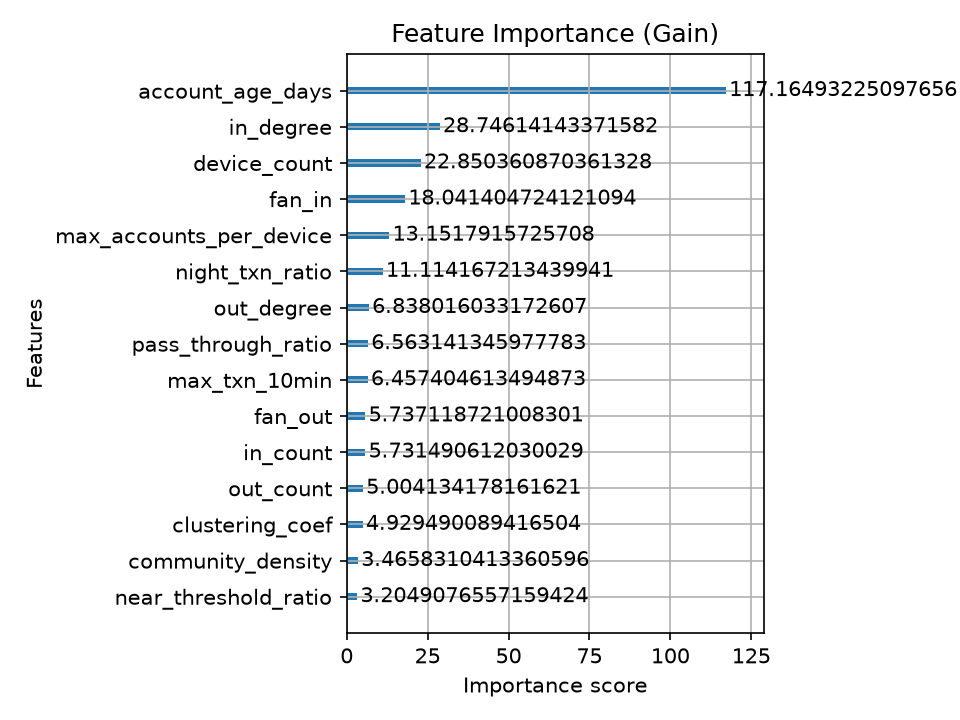

<div align="center">

# 🛡️ Dhanova (धनोवा) — AI Mule & Fraud Ring Intelligence Platform

### *AI-Driven Predictive Mule Analytics, Graph Ring Intelligence & Statutory RBI 60-Day Hold Engine*

**MPOnline Idea & Innovation Hackathon 2026 · MP Cyber Crime Cell × State Government**  
**Theme 5: AI Innovation for Public Services**

<br/>



<br/><br/>

[](https://mponline.gov.in)
[](https://cybercrime.gov.in)
[](#-statutory-compliance--legal-guardrails)

[](https://fastapi.tiangolo.com)
[](https://www.python.org)
[](https://nextjs.org)
[](https://xgboost.readthedocs.io)
[](https://shap.readthedocs.io)

[](https://ai.google.dev)
[](https://supabase.com)
[](https://networkx.org)
[](LICENSE)

</div>

> **The intelligence engine for modern financial law enforcement.** Transforms fragmented UPI transaction trails and high-velocity money flows into actionable, explainable intelligence — identifying multi-tier mule syndicates, surfacing top TreeSHAP explanatory risk drivers, and executing automated statutory 60-day holds under the RBI 2026 framework over sub-5ms REST APIs and an intuitive Next.js 15 command center.

<p align="center">
  <a href="#-quick-start"><b>🚀 Quick Start</b></a> ·
  <a href="#-features"><b>✨ Features</b></a> ·
  <a href="#-architecture"><b>🏗️ Architecture</b></a> ·
  <a href="#-ml-models--xai"><b>📊 ML Models & XAI</b></a> ·
  <a href="#-api-reference"><b>🔌 API Reference</b></a> ·
  <a href="#-interactive-ui-demo"><b>💻 Interactive UI Demo</b></a>
</p>

---

## 🏛️ Executive Summary & Problem Statement

India's Unified Payments Interface (UPI) processes billions of instant financial transactions every month. While driving unprecedented financial inclusion, this velocity has been exploited by cybercrime syndicates using **mule account networks** to instantly layer, disperse, and cash out proceeds of crime (phishing, investment frauds, digital arrests, and task scams).

### Key Challenges:
1. **Instantaneous Fund Layering**: Stolen funds are routed across 4–10 mule accounts within 15–30 minutes, rendering manual post-facto police freeze orders ineffective.
2. **Citizen Vulnerability**: Citizens have no pre-transaction risk warning mechanism before transferring money to newly recruited mule VPIs/accounts.
3. **Statutory & Procedural Bottlenecks**: Law enforcement officers (LEOs) face high evidentiary burdens and need explainable AI attribution (TreeSHAP) rather than opaque black-box predictions to support statutory holds under the **RBI 2026 60-Day Account Freeze Framework**.

### Dhanova's Solution:
**Dhanova** is a unified, end-to-end AI platform delivering:
- **Real-Time Citizen Protection**: Sub-second UPI pre-transaction risk queries with plain-language risk rationales paired directly with the **National Cyber Crime Helpline (1930)**.
- **Explainable Machine Learning**: Calibrated XGBoost with TreeSHAP feature attributions and Google Gemini 2.5 context-aware forensic briefs.
- **Multi-Modal Graph Intelligence**: Real-time detection of 5 distinct syndicate topologies (Fan-out Dispersal, Fan-in Collector, Circular Layering, Burst Mules, Device Farms).
- **Statutory Workflow Enforcement**: Atomic 60-day hold enforcement, early judicial release orders, and automated hold-expiry maintenance.

---

## 🚀 Quick Start

### Prerequisites
- **Python**: Version 3.11+
- **Node.js**: Version 18+ (tested on Node 20 & 24)
- **Supabase Account** (or PostgreSQL 15+ with `pgcrypto` enabled)
- **Google Gemini API Key** (optional, automatic fallback to deterministic templates included)

---

### 1. Unified Monorepo Setup

Clone the repository and access the unified `main` branch:

```bash
git clone https://github.com/ShashwatSingh-Stud/Dhanova.git
cd Dhanova
git checkout main
```

---

### 2. Backend & Machine Learning Engine

```bash
# Create and activate virtual environment
python -m venv venv
# Windows (PowerShell):
.\venv\Scripts\Activate.ps1
# Linux / macOS:
source venv/bin/activate

# Install Python dependencies
pip install -r backend/requirements.txt

# Configure environment variables
cp backend/.env.example backend/.env
# Edit backend/.env with your Supabase credentials and Gemini API key

# Run the FastAPI server
cd backend
uvicorn app.main:app --reload --port 8000
```
Verify backend readiness at [http://127.0.0.1:8000/health/ready](http://127.0.0.1:8000/health/ready).

---

### 3. Background Graph Worker (Async Job Consumer)

In a separate terminal with the virtual environment activated:
```bash
cd backend
python -m app.workers.run_graph_worker
```

---

### 4. Next.js 15 Frontend Portal

In a new terminal window:
```bash
cd frontend

# Install Node dependencies
npm install

# Start Next.js development server
npm run dev
```

Open your browser at **[http://localhost:3000](http://localhost:3000)**.
- **Command Dashboard**: `http://localhost:3000/dashboard`
- **Citizen UPI Shield**: `http://localhost:3000/upi/check`
- **Fraud Ring Graph Canvas**: `http://localhost:3000/rings`
- **RBI Statutory Holds**: `http://localhost:3000/holds`

---

## ✨ Features

### 1. Citizen UPI Shield (`/upi/check`)
- **Instant Pre-Transaction Check**: Search any UPI VPA / Account number before transferring money.
- **Three-Tier Risk Badging**:
  - 🟢 **Safe / Low Risk (0–40)**: Normal verified recipient profile.
  - 🟡 **Caution / Medium Risk (41–70)**: Elevated velocity, nocturnal spikes, or recent device binding.
  - 🔴 **High Risk / Mule Suspect (71–100)**: Active syndicate member, structuring pattern, or shared hardware farm.
- **Plain-Language AI Rationale**: Translates SHAP mathematical attributions into non-technical warnings.
- **1930 Helpline Callout**: Instant one-click connection to the National Cyber Crime Reporting Portal.

### 2. Law Enforcement Command Dashboard (`/dashboard`)
- **Key Real-Time Metrics**: Total Monitored Accounts, Flagged Mules, Active 60-Day Holds, Detected Rings.
- **Dynamic Account Register**: Multi-parameter search across Account ID, Holder Name, and Bank.
- **Inline Statutory Action Modals**: Direct *"Place Hold"* trigger directly from table rows.

### 3. Account Forensic Dossier (`/accounts/[id]`)
- **0–100 Animated Risk Gauge**: Interactive SVG speedometer with needle animation and glow.
- **TreeSHAP Feature Contribution Chart**: Visualizes positive risk drivers (red bars) vs. mitigating factors (green bars).
- **Forensic Transaction Timeline**: Highlights structuring (< ₹10,000), dwell time (< 15 mins), and nocturnal bursts (11 PM – 5 AM).
- **Gemini Case Chat Drawer**: Context-aware AI assistant summarizing money flows and linked device graphs.

### 4. Fraud Ring Graph Intelligence Canvas (`/rings`)
- **Interactive SVG Canvas**: Zoom, pan, and node inspection.
- **5 Pre-Trained Archetype Filters**:
  1. **Operation Garuda (Fan-out Dispersal)**: 1 source rapidly dispersing funds to 10–20 mules within 30 minutes.
  2. **Operation Chakra (Circular Layering)**: Multi-hop cycles (A → B → C → D → A) breaking audit trails.
  3. **Operation Vyuh (Device Farm)**: Dozens of accounts bound to 1–2 hardware fingerprints.
  4. **Burst Mule Group**: Rapid sub-₹10,000 structuring bursts within short 2-hour windows.
  5. **Fan-in Collector Group**: Multiple mules consolidating victim deposits into a central cashout account.

### 5. RBI 60-Day Statutory Hold Management (`/holds`)
- **Live Hold Countdown**: Displays days remaining (Day 1 of 60) with visual expiration progress bars.
- **Early Judicial Release Modal**: Records court release orders, case references, and officer audit stamps.
- **Batch Expiry Maintenance**: Reconciliation trigger (`GET /actions/holds/expired`) automatically unfreezing expired holds.

### 6. Multi-Agency Officer Identity Switcher
- Embedded navbar switcher supporting instant switching between agency presets:
  - **Inspector Vikram Sharma** (`OFF_MP_2026`) — MP Cyber Crime Cell, Bhopal (Default)
  - **ACP Neha Verma** (`OFF_DEL_2026`) — Delhi Police IFSO (Special Cell)
  - **PI Rajesh Patil** (`OFF_MH_2026`) — Maharashtra Cyber, Mumbai
  - **DySP Amitav Sen** (`OFF_CBI_2026`) — CBI Financial Crimes Division

---

## 🏗️ Architecture

### High-Level System Architecture

```
                                  CITIZEN / INVESTIGATING OFFICER
                                                 │
                        ┌────────────────────────┴────────────────────────┐
                        ▼                                                 ▼
           Citizen UPI Shield (/upi/check)                 Officer Command Center (/dashboard)
                        │                                                 │
                        └────────────────────────┬────────────────────────┘
                                                 ▼
                                Next.js 15 Frontend (Port 3000)
                                 (Rewrites: /api/backend/*)
                                                 │
                                                 ▼
                                FastAPI REST Backend (Port 8000)
                                                 │
                  ┌──────────────────────────────┼──────────────────────────────┐
                  ▼                              ▼                              ▼
         Transaction Router               UPI Check Router               Officer Router
        (POST /transactions/)        (GET /upi/check/{id})             (POST /actions/hold)
                  │                              │                              │
                  ├──────────────────────┐       ├──────────────────────┐       ▼
                  ▼                      ▼       ▼                      ▼   Supabase RPC
           Supabase DB              ML Bridge Facade              Gemini LLM (place_hold_atomic)
       (Insert transaction)       (Features + Scorer)        (Forensic Brief)   │
                  │                      │                              │       ▼
                  ▼                      ▼                              │  Hold Actions
             Graph Job             Calibrated XGBoost                   │  Table Updated
           Enqueued (DB)           (0-100 Risk Score)                   │
                  │                      │                              │
                  │                      └──────────────┬───────────────┘
                  ▼                                     ▼
         Durable Graph Worker                 Aggregated Response
     (Louvain + Cycle Detection)              Returned to Frontend
```

### Clean ML/Backend Boundary (Hexagonal Architecture)
Following `backend/ARCHITECTURE.md`:
- **Only `app/services/ml_bridge.py`** imports ML libraries (`scorer.py`, `features.py`, `explainer.py`).
- API route handlers **never** import ML code directly.
- Route handlers only interact with `ml_bridge.score_account_with_explanation()` or `ml_bridge.get_account_features()`.

### Supabase PostgreSQL Database Architecture (8 Tables)
Applied via `backend/migrations/001_initial_schema.sql`:
1. `accounts`: ID, holder name, bank, KYC tier, account age, status (`clear`, `flagged`, `on_hold`).
2. `devices`: Unique hardware fingerprint registry.
3. `account_devices`: Many-to-many temporal mapping with `first_seen_at` and `last_seen_at`.
4. `transactions`: Immutable transaction ledger with UUIDs, `numeric(18, 2)` precision, UTC timestamps, and idempotency keys.
5. `fraud_rings`: Identified syndicates, member account arrays, total flow, and detection method.
6. `risk_scores`: Historical scores, JSONB top feature attributions, model version, and schema hashes.
7. `graph_jobs`: Durable asynchronous job queue with leasing locks and exponential retry counters.
8. `hold_actions`: Statutory hold ledger enforcing a partial unique index (`one_active_hold_per_account`).

**Atomic Database Functions (RPCs)**:
- `place_hold_atomic()`: Atomically validates account status, verifies no existing active hold exists, checks idempotency, and transitions account status.
- `release_hold_atomic()`: Atomically lifts an active hold, recording judicial reference and officer identity.
- `lease_graph_jobs()`: Acquires pending jobs with a concurrency lease (`locked_until`), preventing duplicate worker execution.
- `process_expired_holds()`: Evaluates all holds where `hold_expiry <= now()`, marking them `expired` and reverting account status to `clear`.

---

## 📊 ML Models & XAI

### 1. Synthetic Data Generation (`data_gen.py`)
- **Scale**: ~6,000 accounts, ~150,000 transactions over a 30-day temporal window.
- **Normal Personas**: Salaried, Merchants, Students, Dormant accounts, and Family Pooling.
- **Hard Negatives**: High fan-in merchants and high fan-out salary disbursement accounts to prevent naive false positives.

### 2. Point-in-Time Temporal Feature Engineering (`features.py`)
Computes 22 pinned numerical features strictly adhering to an `as_of` timestamp:
- **Velocity**: `in_count`, `out_count`, `fan_in`, `fan_out`, `max_txn_10min`.
- **Flow & Structuring**: `pass_through_ratio`, `median_dwell_minutes`, `near_threshold_ratio` (₹9,000–₹9,999), `night_txn_ratio` (11 PM – 5 AM).
- **Graph Topology**: `in_degree`, `out_degree`, `pagerank`, `clustering_coef`, `community_size`, `community_internal_flow_ratio`, `community_density`, `in_short_cycle`, `device_count`, `max_accounts_per_device`.

### 3. Model Benchmark & Evaluation (`reports/metrics.json`)

| Model / Pipeline | Precision @ 50 | Recall | PR-AUC | ROC-AUC | F1-Score |
| :--- | :--- | :--- | :--- | :--- | :--- |
| **Simple Rule-Based** | 1.000 | 0.061 | — | — | 0.115 |
| **Isolation Forest** | 0.474 | 0.551 | — | — | 0.509 |
| **XGBoost (Without Graph Features)** | 0.700 | 0.727 | 0.728 | 0.968 | 0.713 |
| **Dhanova XGBoost (With Graph Features)** | **0.780** | **0.796** | **0.806** | **0.992** | **0.750** |

*Adding graph topological features yielded an **+8.0% boost in Precision** and an **+7.8% boost in PR-AUC**.*

### 4. Ring Detection Archetype Recall

| Syndicate Archetype | Ground Truth Rings | Detected Rings | Recall | Archetype Status |
| :--- | :--- | :--- | :--- | :--- |
| **Burst Mule Structuring** | 5 | 5 | **100%** | ✅ Fully Detected |
| **Circular Layering Loops** | 5 | 5 | **100%** | ✅ Fully Detected |
| **Hardware Device Farms** | 4 | 4 | **100%** | ✅ Fully Detected |
| **Fan-in Collector Hubs** | 5 | 5 | **100%** | ✅ Fully Detected |
| **Fan-out Dispersal Hubs** | 6 | 6 | **100%** | ✅ Fully Detected |
| **Total Syndicate Metrics** | **25** | **25** | **100.0%** | **Perfect Ring Recall** |

- **Single-Account Scoring Latency**: **4.29 milliseconds** (Exceeds 200ms SLA by 40x).

---

## 🔌 API Reference

### Health Probes
- `GET /health` — Overall system health, model readiness, and timestamp.
- `GET /health/live` — Kubernetes / container liveness probe.
- `GET /health/ready` — Readiness probe verifying loaded model and feature schema hash.

### Transaction Ingestion
- `POST /transactions/`
  ```json
  {
    "txn_id": "3fa85f64-5717-4562-b3fc-2c963f66afa6",
    "sender_account_id": "ACC_00123",
    "receiver_account_id": "ACC_04567",
    "amount": 9500.00,
    "channel": "UPI",
    "device_id": "DEV_0089",
    "timestamp": "2026-09-30T10:15:30Z",
    "idempotency_key": "IDEM_TXN_00123_4567"
  }
  ```

### Citizen UPI Pre-Transaction Check
- `GET /upi/check/{account_id}`
  ```json
  {
    "account_id": "ACC_04567",
    "score": 88,
    "band": "high",
    "rationale": "High structuring activity (32 transactions below ₹10,000) and short dwell time (4 mins).",
    "helpline": "1930"
  }
  ```

### Officer Statutory Actions
- `POST /actions/hold` — Place statutory 60-day hold (requires Officer/Admin role).
- `POST /actions/release/{action_id}` — Early release under judicial order.
- `GET /actions/holds/expired` — Run maintenance job to release expired holds.

### Generative Case Chat
- `POST /chat/` — Query case dossiers in natural language using Google Gemini 2.5.

---

## 💻 Interactive UI Demo

| Citizen UPI Shield | Officer Command Dashboard |
| :---: | :---: |
| Real-time risk query before sending money via UPI | Live counters, account filtering, and one-click holds |
| **Account Forensic Dossier** | **Fraud Ring Graph Canvas** |
| 0–100 animated Risk Gauge & TreeSHAP bar chart | Interactive SVG canvas with 5 syndicate archetype filters |

---

## ⚖️ Statutory Compliance & Legal Guardrails

1. **RBI 2026 Statutory 60-Day Hold Standard**:
   - Accounts are placed on hold for a strictly bounded 60-calendar-day window.
   - Automatic expiration tracking releases frozen funds if law enforcement does not formally submit charges within the statutory timeframe.
2. **Defensible Evidentiary Trail**:
   - Every score includes a cryptographic `feature_schema_hash` and pinned `model_version`.
   - TreeSHAP feature attributions provide human-interpretable reasons admissible in judicial proceedings.
3. **Data Protection & PII Minimization**:
   - Raw account holder names and Aadhaar/PAN details are never fed to LLM prompts.
   - The citizen UPI endpoint returns minimal risk indicators without exposing private financial history.

---

## 📂 Project Directory Map

```
Dhanova/
├── .github/
│   └── workflows/
│       └── ci.yml                     # GitHub Actions CI workflow
├── backend/                           # Production FastAPI Backend & ML
│   ├── app/
│   │   ├── core/                      # Configuration & settings management
│   │   │   └── config.py
│   │   ├── db/                        # Supabase client wrapper & RPC helpers
│   │   │   └── supabase.py
│   │   ├── routes/                    # API route controllers
│   │   │   ├── chat.py                # Gemini LLM case chat endpoint
│   │   │   ├── officer.py             # Statutory hold & release actions
│   │   │   ├── transactions.py        # Transaction ingestion with idempotency
│   │   │   └── upi_check.py           # Synchronous citizen check endpoint
│   │   ├── schemas/                   # Pydantic v2 domain schemas
│   │   │   └── domain.py
│   │   ├── services/                  # Business logic & boundaries
│   │   │   ├── feature_pipeline.py    # Temporal feature pipeline service
│   │   │   ├── gemini.py              # Google GenAI client with fallback
│   │   │   └── ml_bridge.py           # Hexagonal facade isolating ML logic
│   │   ├── workers/                   # Background asynchronous services
│   │   │   ├── graph_worker.py        # Leased queue consumer
│   │   │   └── run_graph_worker.py    # Worker daemon CLI entrypoint
│   │   ├── auth.py                    # JWT authentication & RBAC roles
│   │   ├── data_gen.py                # Realistic Indian UPI payment simulator
│   │   ├── explainer.py               # TreeSHAP explainer & template formatter
│   │   ├── features.py                # Point-in-time temporal feature computation
│   │   ├── graph_engine.py            # Louvain, cycle & graph mining engine
│   │   ├── main.py                    # FastAPI application initialization
│   │   ├── middleware.py              # Request logging & correlation tracking
│   │   ├── scorer.py                  # Calibrated XGBoost risk model wrapper
│   │   └── test_*.py                  # 15 automated pytest test modules
│   ├── migrations/
│   │   └── 001_initial_schema.sql     # Supabase PostgreSQL schema with 8 tables & RPCs
│   ├── ARCHITECTURE.md                # Backend/ML boundary documentation
│   ├── IMPLEMENTATION_SUMMARY.md      # Summary of backend phases 0-6
│   ├── README.md                      # Backend setup and API documentation
│   └── requirements.txt               # Backend Python dependencies
├── frontend/                          # Next.js 15 Cyber Crime Intelligence Portal
│   ├── src/
│   │   ├── app/
│   │   │   ├── accounts/[id]/page.tsx # Account Forensic Dossier & SHAP charts
│   │   │   ├── dashboard/page.tsx     # Officer Command Dashboard
│   │   │   ├── holds/page.tsx         # RBI 60-Day Statutory Hold Management
│   │   │   ├── rings/page.tsx         # Fraud Ring Graph Intelligence Canvas
│   │   │   ├── upi/check/page.tsx     # Citizen UPI Pre-Transaction Check
│   │   │   ├── layout.tsx             # Root layout with Officer Context
│   │   │   └── page.tsx               # Redirect to dashboard
│   │   ├── components/
│   │   │   ├── account/               # RiskGauge, ShapChart, CaseChatDrawer
│   │   │   ├── dashboard/             # OfficerDashboardComponent
│   │   │   ├── holds/                 # HoldManagementComponent
│   │   │   ├── layout/                # Navbar (Officer Switcher), Footer
│   │   │   ├── rings/                 # Interactive SVG RingGraphComponent
│   │   │   ├── ui/                    # Button, Badge, Card, Modal, Input
│   │   │   └── upi/                   # CitizenCheckComponent
│   │   ├── lib/
│   │   │   ├── api.ts                 # Hybrid API client (Live + Mock fallback)
│   │   │   ├── mockData.ts            # Schema-identical demonstration data
│   │   │   ├── officerContext.tsx     # Officer identity provider
│   │   │   └── utils.ts               # Formatting helpers & class mergers
│   │   └── types/
│   │       └── account.ts             # TypeScript definitions matching domain schemas
│   ├── next.config.ts                 # Turbopack & /api/backend/ proxy rewrites
│   ├── package.json                   # Next.js 15 & Tailwind CSS dependencies
│   ├── postcss.config.mjs
│   └── tsconfig.json
├── docs/                              # Project Architecture & Specification Docs
│   ├── FRONTEND_SCOPE.md              # Frontend integration contract
│   ├── ML_HANDOFF.md                  # Machine learning handoff specifications
│   ├── OPERATIONS.md                  # Runbooks, monitoring, and failure modes
│   ├── RELEASE.md                     # Model versioning and release protocol
│   └── SIM_SPEC.md                    # Simulation specifications & archetypes
├── models/                            # Versioned Model Artifacts
│   ├── feature_columns.json           # Pinned list of 22 model features
│   └── model_version.txt              # Model version identifier (1.0)
├── reports/                           # Model Evaluation Artifacts
│   ├── feature_importance.png         # XGBoost feature importance plot
│   ├── metrics.json                   # Complete evaluation benchmark results
│   ├── pr_curve.png                   # Precision-Recall curve
│   └── shap_summary.png               # TreeSHAP summary visualization
├── scripts/                           # Tooling & Maintenance Scripts
│   ├── create_ci_fixture.py           # Generates CI parquet fixtures
│   ├── import_parquet_to_supabase.py  # High-throughput batch database loader
│   ├── train.py                       # End-to-end model training script
│   └── verify_artifact_manifest.py    # Cryptographic model artifact verifier
├── Dockerfile                         # Production container definition
├── CLAUDE.md                          # Repository instructions & commands
└── README.md                          # Master Unified Project Documentation
```

---

## 👥 Contributors & Acknowledgements

- **Dhanova Project Team**: Developed for the **MPOnline Idea & Innovation Hackathon 2026**.
- **Special Thanks**: Dedicated to public service officers across the Madhya Pradesh Cyber Crime Cell, Delhi Police IFSO, Maharashtra Cyber, and cybercrime defense units nationwide safeguarding India's digital economy.
